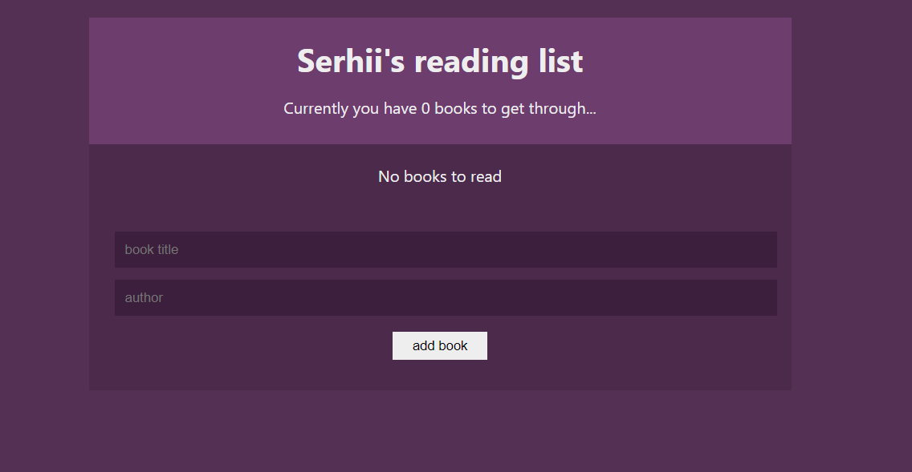
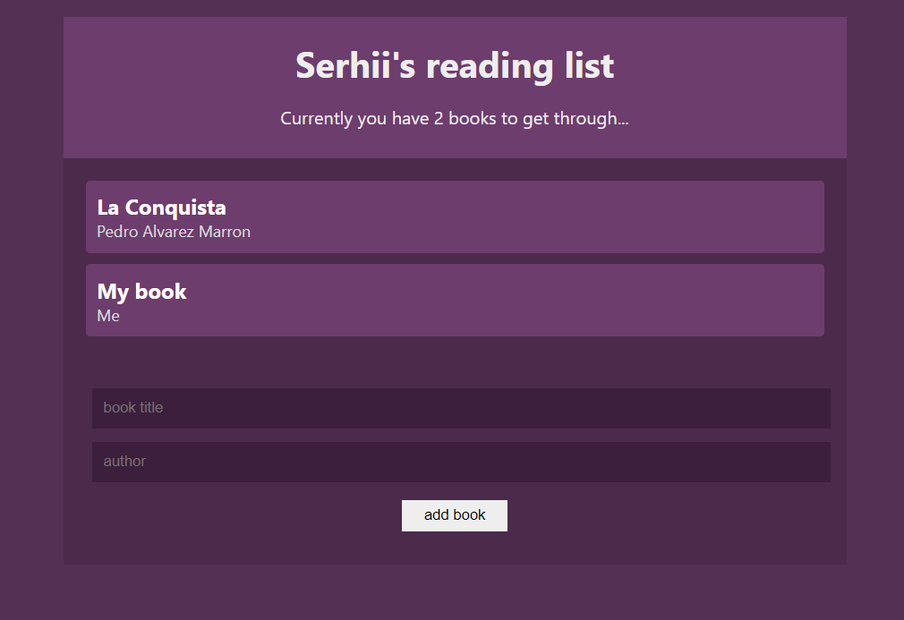

# booklist
##  Booklict

## AIM OF THE PROJECT

### I mastered:

- [x] createContext;
- [x] useReducer hook;
- [x] useEffect hook;
- [x] working with localStorage

[demo](https://serhiisergio.github.io/booklist/)

### SCREENSHOTS

## STRUCTURE OF THE PROJECT

This project consists of a root component `App.js` which contains several components with their css styles. You can write your blog, save it, and delete it.

Go up to the [Header](#header) !
